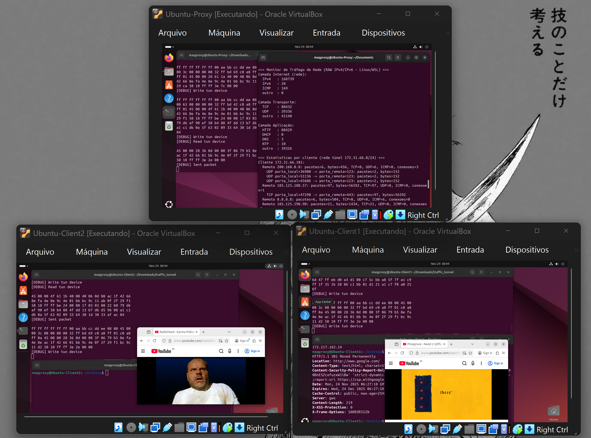
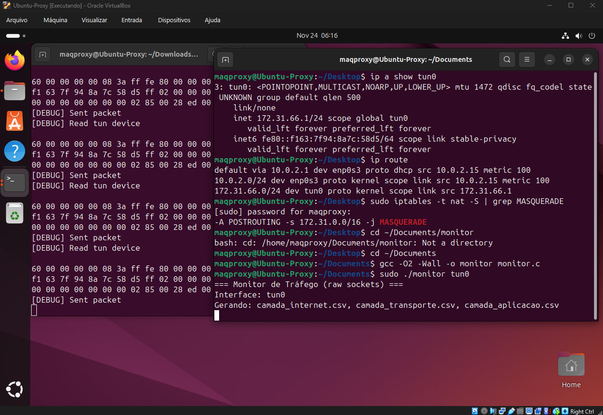
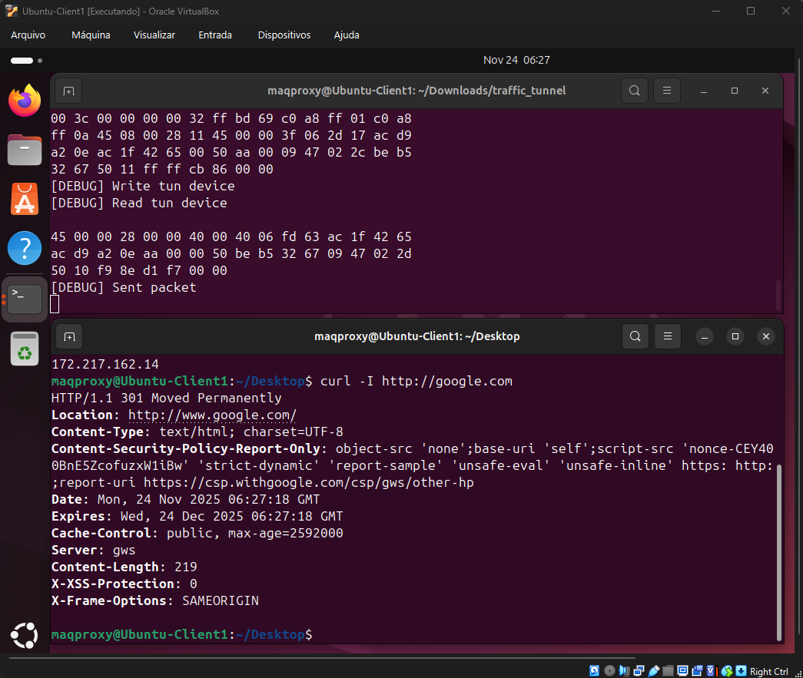
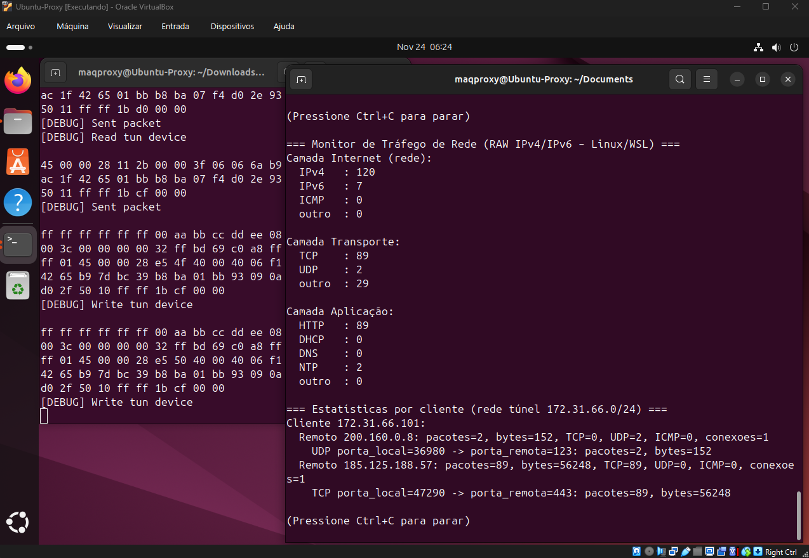
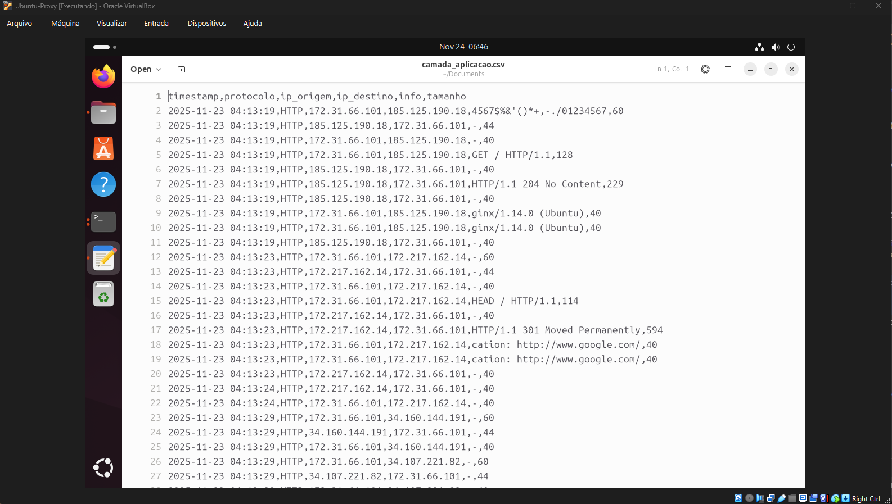
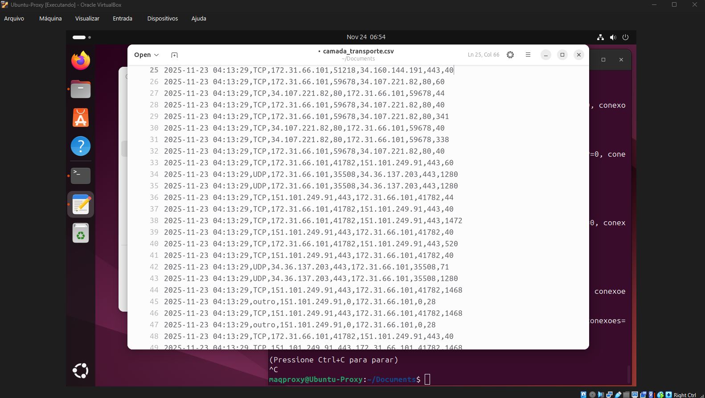

# Monitor de Tráfego de Rede — classificação de pacotes sobre um túnel TUN com raw sockets

Monitor de tráfego escrito em **C com raw sockets** (`AF_PACKET`) que observa os
pacotes atravessando um túnel ponto-a-ponto (TUN) entre um proxy e dois clientes,
classifica cada pacote nas camadas de **rede, transporte e aplicação**, grava a
captura em três arquivos CSV e mantém, em tempo real, estatísticas
**por cliente → destino remoto → fluxo**.

---

## Sobre

O objetivo é interceptar e classificar tráfego real diretamente sobre os bytes de
cada pacote, sem usar bibliotecas de captura prontas (como `libpcap`). Todo o
caminho pela pilha é percorrido manualmente:

- normalização do enquadramento de enlace (IP "nu" da `tun0`, Ethernet ou *cooked SLL*);
- leitura dos cabeçalhos IPv4/IPv6 e identificação de ICMP;
- leitura de TCP/UDP e extração de portas;
- inferência da aplicação por porta e extração de metadados do payload
  (primeira linha do HTTP, nome consultado no DNS, tipo de mensagem DHCP, campos do NTP).

O experimento roda em **três máquinas virtuais independentes** (um proxy e dois
clientes), atendendo à restrição do enunciado de não executar tudo em um mesmo host.

## Demonstração

O laboratório inteiro em operação: os dois clientes navegando normalmente (à esquerda
e à direita) enquanto o proxy, no alto, roda o monitor sobre a `tun0` e classifica em
tempo real todo o tráfego que passa pelo túnel.



## Ambiente e arquitetura

Três VMs Ubuntu na mesma *NAT Network* do VirtualBox (`LabNAT`, 10.0.2.0/24). A rede
interna do túnel é a `172.31.66.0/24`:

- **Proxy / Servidor (`172.31.66.1`)** — sobe a `tun0`, habilita *IP forwarding* e NAT
  (`iptables MASQUERADE`) e roda o **monitor** sobre a `tun0`.
- **Client1 (`172.31.66.101`)** e **Client2 (`172.31.66.102`)** — sobem a `tun0`,
  colocam a rota padrão pelo túnel e geram tráfego real (navegação, `ping`, `curl`).


O ponto central: **o monitor apenas observa** a `tun0`; quem encaminha o tráfego para a
Internet é o túnel somado ao NAT no proxy. O fluxo de um pacote é:

```
cliente → tun0 (cliente) → túnel → tun0 (proxy) → [monitor observa aqui]
                                          → IP forward + NAT → Internet
```

## Como funciona

O monitor abre um raw socket preso à interface e decodifica cada pacote de cima para
baixo na pilha, sempre validando o tamanho do buffer antes de acessar um cabeçalho.

**1. Enlace (`parse_l2`).** Como a `tun0` entrega pacotes IP sem cabeçalho de enlace e
algumas interfaces expõem cabeçalhos "cozidos" (SLL), o código reconhece por heurística
três formatos — IP "nu", Ethernet e SLL v1/v2 — e devolve o *offset* correto para as
camadas superiores, funcionando igual em qualquer um dos casos.

**2. Rede.** Interpreta IPv4/IPv6, extrai os endereços de origem/destino e o tamanho do
pacote. Em ICMP, além de contabilizar, extrai `type` e `code`.

**3. Transporte.** Identifica TCP/UDP e extrai as portas de origem e destino.

**4. Aplicação.** Infere o protocolo pelas portas conhecidas (HTTP 80/8080/443;
DNS 53/5353; DHCP 67/68; NTP 123) e, quando há payload, guarda um resumo útil: a
primeira linha do HTTP, o `id`/tipo/QNAME do DNS, o *message type* do DHCP ou os campos
LI/VN/Mode do NTP.

**5. Agregação e saída.** Cada evento vira uma linha em um dos três CSVs (rede,
transporte, aplicação, em modo *append* com cabeçalho condicional). Em paralelo, uma
tabela em memória agrega o tráfego por **cliente → IP remoto → fluxo**, e um painel é
reimpresso a cada segundo. Um cliente é identificado por pertencer ao bloco do túnel:

```
é_cliente(ip)  ⇔  ip começa com "172.31.66."
```

## Como executar

Requisitos (nas três VMs): Linux com `gcc` e utilitários de rede.

```
sudo apt install -y build-essential net-tools iproute2 iptables curl dnsutils
```

**1. Compilar.**

```
# nos clientes e no proxy
cd traffic_tunnel && make

# no proxy (o monitor)
cd .. && make
```

**2. Subir o túnel.**

```
# no PROXY (modo servidor): cria tun0=172.31.66.1, NAT e forwarding
sudo ./traffic_tunnel enp0s3 -s

# no CLIENT1 e no CLIENT2 (modo cliente)
sudo ./traffic_tunnel enp0s3 -c ./client1.sh
sudo ./traffic_tunnel enp0s3 -c ./client2.sh
```

**3. Rodar o monitor (no proxy).** O raw socket exige privilégios de root; passe a
interface a observar:

```
sudo ./monitor tun0
```



**4. Gerar tráfego (nos clientes).** Basta navegar, ou usar `ping`, `curl`, `dig`.



## Saída

Enquanto os clientes usam a Internet, o monitor atualiza um painel com os contadores
por camada e a árvore por cliente — cada remoto contatado e cada fluxo
`porta_local → porta_remota` com pacotes, bytes e número de conexões:



Em paralelo, tudo é persistido em três CSVs. Na camada de aplicação, o resumo permite,
por exemplo, ver a primeira linha de cada requisição/resposta HTTP:



E a camada de transporte registra cada pacote TCP/UDP com suas portas:



## Estrutura do projeto

```
.
├── monitor.c                # o monitor (raw sockets, classificação, CSVs, stats)
├── Makefile                 # compila o monitor
├── .vscode/
│   └── c_cpp_properties.json # config do IntelliSense
├── traffic_tunnel/          # túnel TUN + scripts do cenário
│   ├── tunnel.c / tunnel.h / traffic_tunnel.c / Makefile
│   └── server.sh / client1.sh / client2.sh
└── docs/                    # imagens usadas neste README
```

## Limitações conhecidas e próximos passos

Escolhas conscientes de escopo, boas candidatas a uma versão futura:

- **Classificação de aplicação por porta.** Tudo em 443 é rotulado como `HTTP`, mesmo
  sendo HTTPS/TLS; o conteúdo é cifrado e não é lido. Como o campo `info` copia bytes do
  payload sem sanitização, em conexões cifradas ele recebe lixo binário — e, se um desses
  bytes for uma vírgula, pode desalinhar as colunas do CSV. Sanitizar/escapar esse campo
  (e detectar payload não textual) é a primeira melhoria óbvia.


- **IPv6 só na camada de rede** — transporte e aplicação em IPv6 não são processados.
- **Parser de DNS simplificado** — não trata compressão de nomes (ponteiros `0xC0`),
  então nomes em respostas podem sair truncados.
- **Estruturas de tamanho fixo** (`MAX_CLIENTES`, `MAX_REMOTOS`, `MAX_FLOWS`) — acima do
  limite, os dados são descartados; uma tabela hash resolveria.
- **Sem remontagem de fragmentos IP, cabeçalhos de extensão IPv6 ou VLAN.**
- **DHCP não aparece na `tun0`** por ser broadcast de enlace; o parser existe e funciona
  quando o monitor roda sobre a interface de acesso do cliente (ex.: `enp0s3`).

## Contexto acadêmico

Trabalho final da disciplina de Laboratório de Redes de Computadores. O enunciado pedia um
túnel ponto-a-ponto com NAT e um monitor próprio, em raw sockets, capaz de classificar o
tráfego por camadas e produzir estatísticas por cliente. O código foi posteriormente
revisado para publicação: ajuste de portabilidade (compila limpo em modo ISO estrito) e
documentação.
