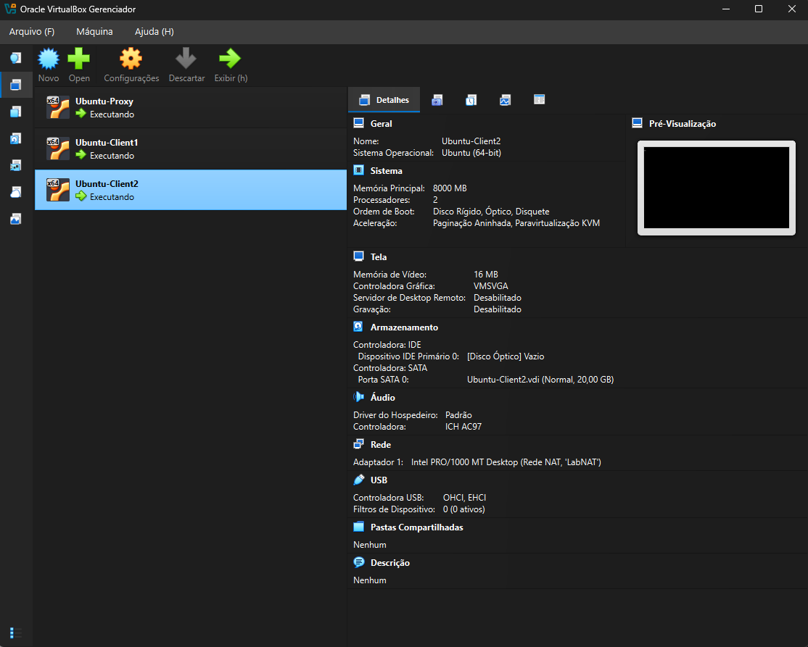
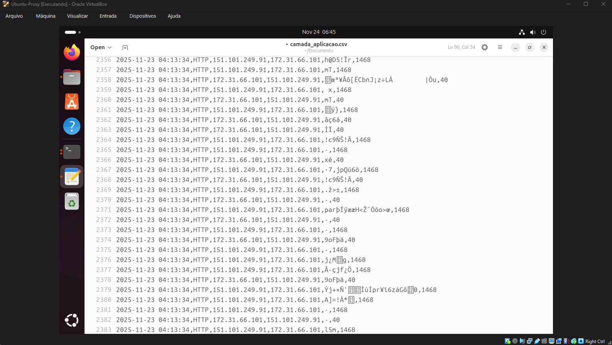

# Network Traffic Monitor — classifying packets on a TUN tunnel with raw sockets

[](https://github.com/pedrorivanunes/raw-socket-traffic-monitor/actions/workflows/ci.yml)
[](https://en.wikipedia.org/wiki/C11_(C_standard_revision))
[](https://www.kernel.org/)
[](LICENSE)

A traffic monitor written in **C with raw sockets** (`AF_PACKET`) that watches the
packets crossing a point-to-point (TUN) tunnel between a proxy and two clients,
classifies each one at the **network, transport and application** layers, writes
the capture to three CSV files, and keeps live statistics per
**client → remote host → flow**.

---

## About

The goal is to intercept and classify real traffic straight from the bytes of
each packet, without an off-the-shelf capture library such as `libpcap`. Every
step up the stack is done by hand:

- working out the link-layer framing (bare IP from `tun0`, Ethernet, or Linux
  *cooked* SLL);
- reading the IPv4/IPv6 headers and identifying ICMP;
- reading TCP/UDP and extracting the ports;
- inferring the application from the port numbers and pulling a summary out of
  the payload (the first line of an HTTP request, the name queried over DNS, the
  DHCP message type, the NTP header fields).

The experiment runs across **three independent machines** — one proxy and two
clients — which was a requirement of the original assignment: it could not all
run on a single host. Those three machines were virtual machines; today the
same lab also comes up with a single `docker compose up`.

## Demo

The whole lab running: both clients browsing normally (left and right) while the
proxy at the top runs the monitor on `tun0` and classifies, in real time, every
packet crossing the tunnel.


> **A note on the screenshots.** These are from the original run on VirtualBox,
> so the monitor's output in them is in Portuguese and the file names are the old
> ones. The code has since been translated and reorganised; the panel and the
> CSV columns now read in English. The screenshots are kept because they are a
> genuine record of the lab on real machines, which is not something the
> container version replaces.

## The lab

Three hosts on one shared network segment. The tunnel's own network is
`172.31.66.0/24`:

- **Proxy / server (`172.31.66.1`)** — brings up `tun0`, enables IP forwarding
  and NAT (`iptables MASQUERADE`), and runs the **monitor** on `tun0`.
- **Client1 (`172.31.66.101`)** and **Client2 (`172.31.66.102`)** — bring up
  `tun0`, put their default route through the tunnel, and generate real traffic.



The important part: **the monitor only observes** `tun0`. What actually moves
traffic to the Internet is the tunnel plus the NAT on the proxy. A packet takes
this path:

```
client → tun0 (client) → tunnel → tun0 (proxy) → [the monitor watches here]
                                          → IP forward + NAT → Internet
```

Because the monitor sits on `tun0`, which is upstream of the NAT, it still sees
each client's own address. That is what makes per-client statistics possible at
all: after the NAT, every packet would look like it came from the proxy.

### Running it with Docker

What the three virtual machines really provided was a single broadcast domain —
the tunnel wraps each packet in a raw Ethernet frame and sends it to the
broadcast address. A Docker bridge network provides exactly the same thing, so
the entire lab fits in one compose file:

```bash
docker compose up --build
```

That starts four containers: the proxy, both clients, and a web server that sits
on a second network reachable *only* through the proxy — so the clients have to
go through the tunnel and the NAT to reach it, and the lab needs no Internet
connection to demonstrate anything. The clients fetch a page every five seconds.

```bash
docker compose logs -f proxy    # the live panel
ls capture/                     # the three CSV files
```

None of the containers is privileged. Each one gets `NET_ADMIN` (to create and
address `tun0` and to change routes), `NET_RAW` (for the `AF_PACKET` sockets),
and `/dev/net/tun`. Every one of those maps to something visible in the code.

There is also an end-to-end test that brings the lab up, waits for a client to
fetch a page through the tunnel, and checks that the capture files describe that
request — the right client address, the right destination, and the request line:

```bash
./docker/integration-test.sh
```

### Running it on three virtual machines

The original setup: three Ubuntu VMs on the same VirtualBox *NAT Network*.

Requirements on each machine:

```bash
sudo apt install -y build-essential iproute2 iptables curl dnsutils
```

**1. Build.**

```bash
make
```

**2. Bring up the tunnel.**

```bash
# on the PROXY (server mode): creates tun0=172.31.66.1, NAT and forwarding
cd tunnel && sudo ../build/traffic_tunnel enp0s3 -s

# on CLIENT1 and CLIENT2 (client mode)
cd tunnel && sudo ../build/traffic_tunnel enp0s3 -c client1.sh
cd tunnel && sudo ../build/traffic_tunnel enp0s3 -c client2.sh
```

**3. Run the monitor (on the proxy).** The raw socket needs root:

```bash
sudo ./build/monitor tun0
```


**4. Generate traffic (on the clients).** Browse, or use `ping`, `curl`, `dig`.


Set `TUNNEL_VERBOSE=1` to make the tunnel trace and hex-dump every packet.

## How it works

The monitor opens a raw socket bound to the interface and decodes each packet
down the stack, checking the buffer length before every single header access.

**1. Link layer (`packet_parse_link_layer`).** A TUN device delivers IP packets
with no link header at all, and some captures arrive in Linux "cooked" (SLL)
framing instead. The code recognises four shapes — bare IP, Ethernet, SLL v1 and
SLL v2 — and returns the correct offset for the layers above, so the same binary
works on `tun0` and on a normal Ethernet interface.

**2. Network.** Reads IPv4/IPv6, extracts the source and destination addresses
and the packet size. For ICMP it also pulls out the `type` and `code`.

The size is taken from the IP header but **clamped to the number of bytes
actually captured**. A forged header claiming 65535 bytes must not be able to
add 65535 to a client's byte total.

**3. Transport.** Identifies TCP/UDP and extracts the port numbers. A TCP data
offset smaller than the minimum, or one pointing past the end of the frame, is
treated as a malformed packet: the ports are still reported, but the payload
position is not trusted and nothing is read from it.

**4. Application.** Infers the protocol from the well-known ports (HTTP 80/8080,
HTTPS 443, DNS 53/5353, DHCP 67/68, NTP 123) and, where there is a payload,
keeps a useful summary: the HTTP request or status line, the DNS question, the
DHCP message type, or the NTP LI/VN/Mode fields.

Two rules keep that summary honest. A payload is only read as HTTP if it
actually *starts* like HTTP — a segment from the middle of a response body is
not a request line — and everything that ends up in the summary is reduced to
printable ASCII.

**5. Aggregation and output.** Each event becomes a row in one of the three CSV
files. In parallel, an in-memory table aggregates traffic by
**client → remote host → flow**, and the panel is reprinted once a second. A
client is identified by belonging to the tunnel's subnet:

```
is_client(ip)  ⇔  ip starts with "172.31.66."
```

A request and its reply are recorded as one flow, not two: the ports are stored
from the client's point of view, so `51000 → 80` and `80 → 51000` are the same
conversation.

## Output

While the clients use the network, the monitor keeps a panel with the per-layer
counters and the per-client tree — every remote host contacted, and every
`local_port → remote_port` flow with its packets, bytes and connection count:


Everything is also written to three CSV files. At the application layer the
summary makes it possible to read, for example, the first line of every HTTP
request and response:


And the transport layer records every TCP/UDP packet with its ports:


Fields are quoted per RFC 4180, so a comma arriving inside an HTTP request line
stays inside its column instead of shifting every column after it.

## Tests

```bash
make test        # the unit tests
make sanitize    # the same tests under AddressSanitizer and UBSan
make check       # both
make analyze     # cppcheck
```

On a machine that is not Linux, the container is the way in — `AF_PACKET`,
`/dev/net/tun` and `netpacket/packet.h` do not exist anywhere else:

```bash
docker build --target tests -t monitor-tests .
docker run --rm monitor-tests
```

The suite is 46 tests over the classifier, the statistics table and the CSV
writer. It runs anywhere: no interface, no root, no traffic. That is possible
because the decoding is pure — bytes in, a classified packet out — and the tests
build those bytes by hand, which also means a malformed packet is as easy to
produce as a well-formed one. Roughly half the tests are packets that lie: a
header claiming a length the frame does not have, a TCP data offset pointing
past the end, a DNS compression pointer where a label length belongs, a DHCP
option that overruns the message.

**AddressSanitizer and UBSan are the part that matters most here.** Every offset
in `packet.c` is read out of a buffer an attacker controls, so ASan is what
proves the bounds checks are real, and UBSan is what catches the misaligned
loads a hand-written parser attracts — after a 14-byte Ethernet header the IP
source address lands on offset 26, so reading it through a `struct iphdr *` is a
4-byte load on a 2-byte boundary. That is why headers are copied into a local
struct before being read rather than cast in place.

Writing the tests and running the tools found real defects, which are fixed:

- the summary field copied raw payload bytes into an unquoted CSV column, so a
  comma in an HTTP request line silently shifted every column after it, and an
  encrypted connection filled the column with binary noise (this was listed as a
  known limitation in the original README):

  

- the statistics tables added up to about 100 MB and were declared as a local
  variable, which overflows the stack before `main()` does anything;
- a plain `strcpy` of the interface name into a 16-byte buffer;
- a `struct sockaddr_ll` passed to `sendto` with most of its fields
  uninitialised;
- the tunnel wrote the whole frame length to the TUN device instead of the inner
  packet length, handing the kernel 34 bytes of whatever followed in the buffer;
- an IP checksum computed by reading bytes through a signed `char`, which
  sign-extends everything above 0x7F — and the addresses involved start with
  192 and 255.

The end-to-end test found one more, in the lab rather than the code: with
forwarding left on, a client will bounce the *other* client's packets back down
the tunnel, and the loop makes the monitor count a single HTTP request about a
hundred times. See the note in `docker-compose.yml`.

## Continuous integration

Every push runs, on GitHub Actions:

- a build and the unit tests under **gcc and clang**, with warnings as errors;
- the suite under **AddressSanitizer and UBSan**, including leak checking;
- **cppcheck** over all sources;
- a build of the container image, and the suite inside it;
- the **three-node lab**, brought up with compose and checked end to end.

## Project structure

```
.
├── src/                      the monitor
│   ├── packet.c/.h           classification: bytes in, classified packet out
│   ├── stats.c/.h            counters and the client → remote → flow tree
│   ├── csv.c/.h              the three capture files, with RFC 4180 quoting
│   └── main.c                the raw socket and the capture loop
├── tunnel/                   the TUN tunnel and the lab scripts
│   ├── tunnel.c/.h           encapsulation and the forwarding loop
│   ├── traffic_tunnel.c      entry point
│   └── server.sh / client1.sh / client2.sh
├── tests/                    unit tests and a small runner
│   ├── harness.c/.h          the test runner
│   ├── frames.c/.h           builds packets by hand
│   └── test_packet.c / test_stats.c / test_csv.c
├── docker/
│   ├── entrypoint.sh         starts one node of the lab
│   └── integration-test.sh   the end-to-end test
├── Dockerfile                build/test image, and the lab image
├── docker-compose.yml        the three-node lab
├── Makefile
└── docs/                     the screenshots used in this README
```

`src/main.c` is the only file that opens a socket. Everything the tests exercise
lives in the other three, which is the reason the split exists.

## Known limitations and next steps

Deliberate scope decisions, and good candidates for a future version:

- **Applications are identified by port number.** Anything on 443 is labelled
  HTTPS and its payload is never read, which is honest but means a protocol on
  a non-standard port is simply "other". Real identification would mean
  inspecting the payload rather than trusting the port.
- **IPv6 stops at the network layer.** Reaching TCP or UDP over IPv6 means
  walking the extension-header chain first, and the lab this was built for
  carried no IPv6 traffic to test that against.
- **DNS parsing covers the question section only.** That section is never
  compressed, so it needs no pointer handling; reading answer records would.
- **The tables are fixed-size** (`STATS_MAX_CLIENTS`, `STATS_MAX_REMOTES`,
  `STATS_MAX_FLOWS`). Past those limits data is dropped — but the drops are
  counted and shown in the panel, rather than disappearing silently. A hash
  table would remove the ceilings.
- **No IP fragment reassembly, IPv6 extension headers or VLAN tags.**
- **DHCP does not appear on `tun0`**, because it is a link-layer broadcast. The
  parser works, and is exercised by the tests and by running the monitor on a
  client's access interface (`enp0s3`, say) instead.
- **The tunnel addresses its ends with two fixed tags**, `192.168.255.1` for the
  server and `.10` for "a client". With more than one client they all answer to
  the same tag, so every client receives every frame and discards what is not
  its own — workable, like a hub, but it is the reason clients must not forward.
  Giving each client its own tag is the obvious fix.

## Academic context

Final project for a Computer Networks Laboratory course. The assignment asked
for a point-to-point tunnel with NAT and a monitor of one's own, built on raw
sockets, able to classify traffic by layer and produce per-client statistics.

The code was later revised for publication: split into modules that can be
tested without root, covered by a test suite run under sanitizers in CI,
translated to English, and given a containerised version of the three-machine
lab.

## License

[MIT](LICENSE)
